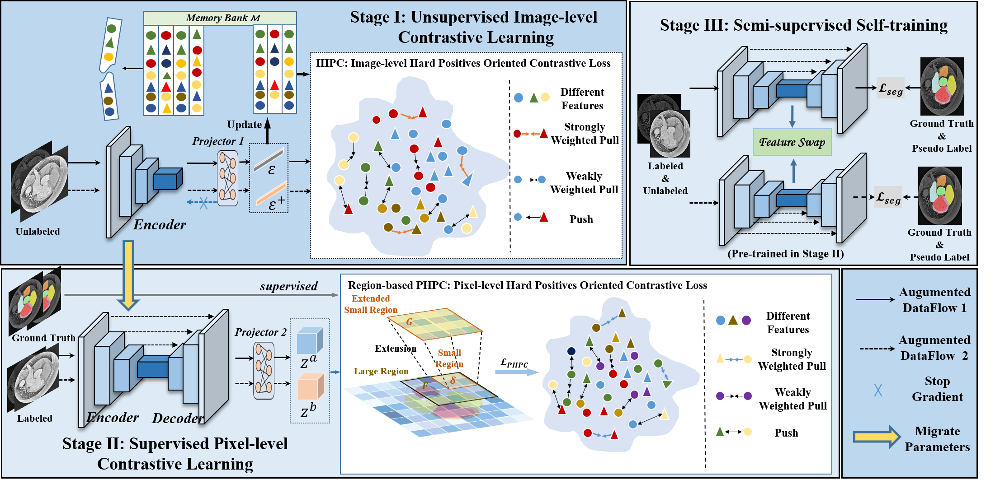

# Semi-supervised Medical Image Segmentation via Hard Positives oriented Contrastive Learning
This is the pytorch implementation of paper "Semi-supervised Medical Image Segmentation via Hard Positives oriented Contrastive Learning".



Email addresses: tangcheng1@stu.scu.edu.cn & perperstudy@gmail.com (Joint First Authors) & wangyanscu@hotmail.com (Corresponding Author)

## Setup
### Environment
```
python=3.7.10
torch==1.8.1
torchvision=0.9.1
```
### Dataset
We will take the [Hippocampus dataset](https://drive.google.com/file/d/1RzPB1_bqzQhlWvU-YGvZzhx2omcDh38C/view?usp=sharing) as the example to illustrate how to do the preprocessing. Put the images .nii.gz files in ./data/Hippocampus/imgs folder and labels files in ./data/Hippocampus/labels.
```
cd dataset/prepare_dataset
python preprcocessing.py
python create_splits.py
```

Afterwards, the images and their respective labels will be combined and saved in a .npy file. The shape of the images will be normalized to match the target size.

## Run the codes
To run the Stage I: Unsupervised Image-level Contrastive Learning,
```
bash run_simclr.sh
```
To run the Stage II: Supervised Pixel-level Contrastive Learning,
```
bash run_coseg.sh
```
To combine the above two pretraining, run run_simclr.sh first and the pretrained model will be saved at save/simclr/Hippocampus/ and set --pretrained_model_path  ${the saved model path} in run_coseg.sh. Remember to load the saved pre-trained model.

To run the Stage III: (Semi-supervised Segmentation),
```
bash run_seg.sh
```

## Important Notes
* In all of the aforementioned three files, "train_sample" denotes the percentage of labeled data to be utilized.

